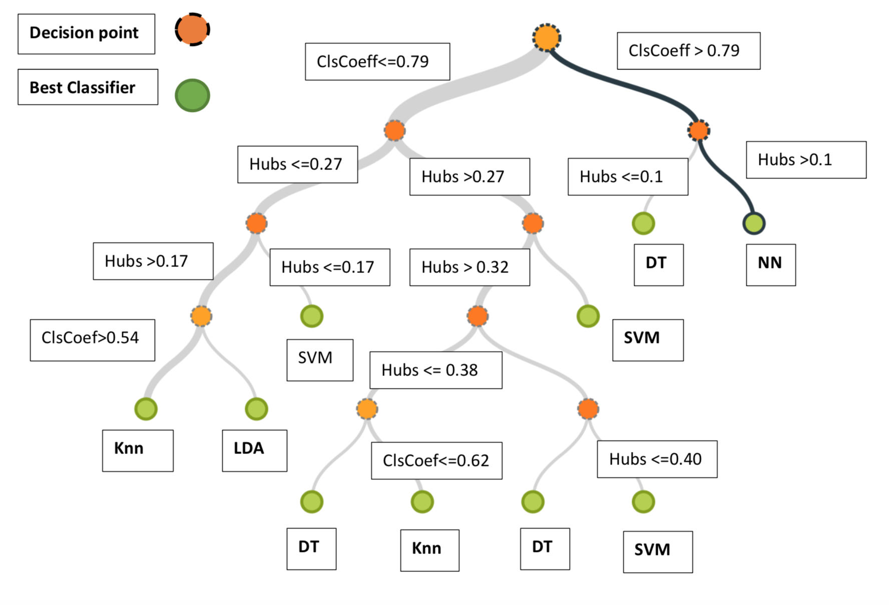

A portion of this project was submitted and accepted at NERCSS 2019 conference; The paper is submission 46!

It's a meta-learning project, determining the domain of competence of a machine learning algorithm based on the network structure of the dataset

# Importance Network-Science-Metrics-In-Classification

Could we determine the classifier to be used on a dataset by computing network metrics on the dataset?
That's the aim of this project;

